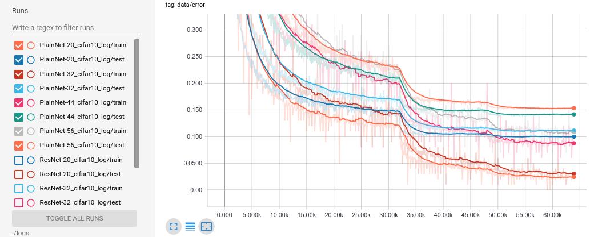
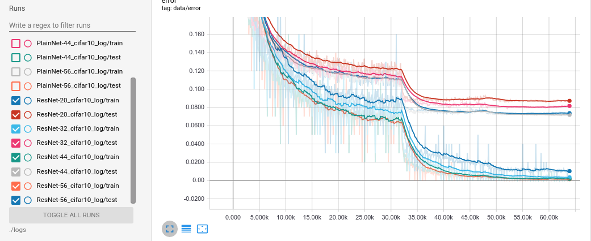

# pytorch-residual-networks

This repository is a PyTorch re-implementation of Kaiming He's "*Deep Residual Learning for Image Recognition*". As the Section 4.2 *CIFAR-10 and Analysis*, we present experiments on Cifar-10 dataset.

### ResNet on Cifar-10

#### 1. Dataset

Dataset: https://www.cs.toronto.edu/~kriz/cifar.html

Data layout: (binaries)

Each image's size is 32x32. A 3073 byte data is used for a single image. The first byte is the label of the first image, which is a number in the range 0-9. The next 3072 bytes are the values of the pixels of the image. The first 1024 bytes are the red channel values, the next 1024 the green, and the final 1024 the blue. The values are stored in row-major order.

#### 2. Data Augmentation

1. RandomHorizontalFlip, p = 0.5
2. RandomCrop, crop to 32x32 with edge-padding=4
3. per-pixel mean substracted, (125, 123, 114) for RGB channel.

#### 3. ResNet Arch

The ResNet architecture has 6n+2 stacked weighted layers.

1. The first layer is conv 3x3.
2. Then a stack of 6n layers with conv3x3 on *[ feature map of size {32, 16, 8} respectively, number of filters are {16, 32, 64} respectively ]*, with 2n layers for each feature map size. 
3. The feature map subsampling is performed with conv3x3 with stride of 2.
4. End with a global average pooling, a 10-way fully-connected layer, and softmax.

We vary n = 3, 5, 7, 9 for ResNet-20, ResNet-32, ResNet-44, and ResNet-56.

#### 4. Hyper-parameter when training

1. SGD, batch_size=100
2. initial lr=0.1, divide by 10 at 32k and 48k iterations, terminate at 64k iterations
3. weight decay=0.0001, momentum=0.9
4. weight initialization
5. BatchNormalization, without Dropout

#### 5. Loss curve

##### PlainNet, without Residual block

training error and test error



##### ResNet

training error and test error



#### 6. Error rate (%)

| #Layer | PlainNet | ResNet |
| :----: | :------: | :----: |
|   20   |  10.08   |  8.74  |
|   32   |  11.15   |  8.30  |
|   44   |  14.12   |  7.16  |
|   56   |  15.39   |  7.41  |

For PlainNet, we can observe the degradation problem: with the network depth increasing, accuracy gets saturated, and then degrades rapidly. ResNet has no more parameters, but achieves high accuracy. And increase ResNet's depth to 44 layers, the error rate is still declining.

#### 7. Use the code

```shell
# For ResNet-56, n=9
python run.py 9 train
# Show training curve, Pytorch+Tensorboardx
tensorboard --logdir=./logs
```

